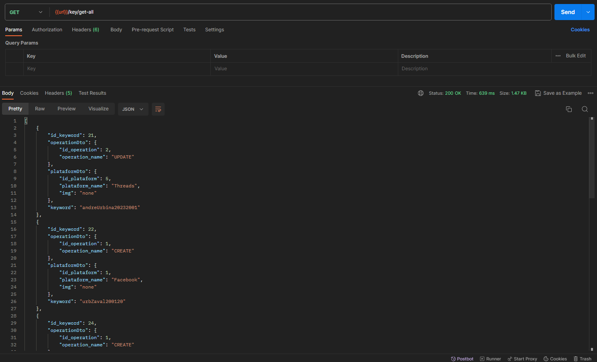

<h1>Password Manager</h1>
<h3>About the project</h3>

This is a project mostly for practicing Java and the Spring Boot Framework for API development and other features like JpaRepository or the Specification Pattern for multiple criteria search.

<h4>What does it do?</h4>

This API it's going to be consumed by a web client. Basically it does the basic crud operations with some extra procedures for paging the data, encrypting or decrypting the information. Here you have some footages of the Postman outputs:

<h3>Built With</h3>
<ul>
<li>

</li>
<li>

</li>
<li>

</li>
<li>

</li>
<li>

</li>
</ul>

<h3>Contact me! 📲</h3>

<b>Name:</b> Emiliano André Urbina Zavala   
<b>Mail me:</b> 
emilianoandreurbinazavala@gmail.com   
<b>Click to chat me:</b>  
  
<b>My LinkedIn</b>  

<h3>Acknowledgments</h3>

Here you have some sites and resources that used for this project development.

<ul>
<li>
<a href="https://www.baeldung.com/java-aes-encryption-decryption">Java AES Encryption and Decryption</a>
</li>
<li>
<a href="https://www.baeldung.com/rest-api-search-language-spring-data-specifications">REST Query Language with Spring Data JPA Specifications</a>
</li>
</ul>

